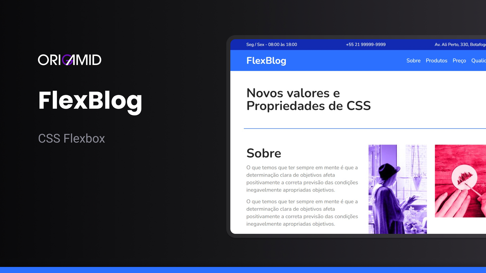

<h1 align="center">FlexBlog</h1>

Projeto web desenvolvido durante curso de CSS Flexbox da Origamid.

  <a href="#-tecnologias-e-ferramentas">Tecnologias</a>&nbsp;&nbsp;&nbsp;|&nbsp;&nbsp;&nbsp;
  <a href="#-projeto">Projeto</a>&nbsp;&nbsp;&nbsp;|&nbsp;&nbsp;&nbsp;
  <a href="#-layout">Layout</a>&nbsp;&nbsp;&nbsp;|&nbsp;&nbsp;&nbsp;
  <a href="#-licença">Licença</a>

  

 

  

## 🚀 Tecnologias e Ferramentas

Esse projeto foi desenvolvido com as seguintes tecnologias e Ferramentas:

## 💻 Projeto

Flexblog é um website desenvolvido e estilizado utilizando CSS Flexbox.

- [Acesse o projeto finalizado aqui](https://diegoespelho.github.io/flexblog-origamid/)

## 🔖 Layout

O layout desse projeto foi desenvolvido utilizando a ferramenta de design Figma.

## 📝 Licença

Esse projeto está sob a licença MIT.
